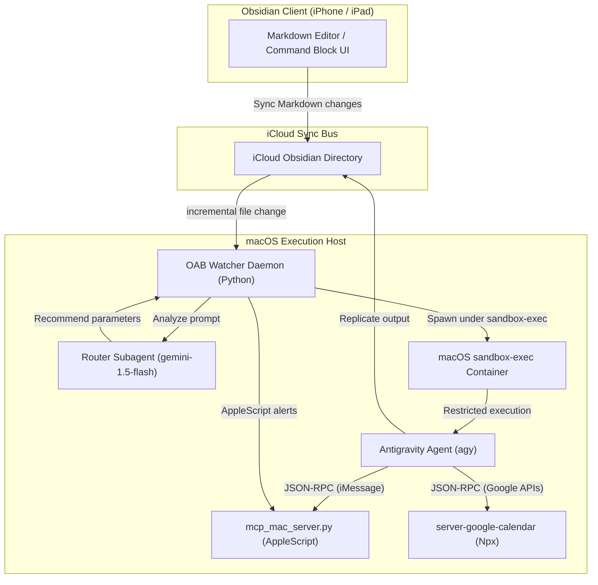
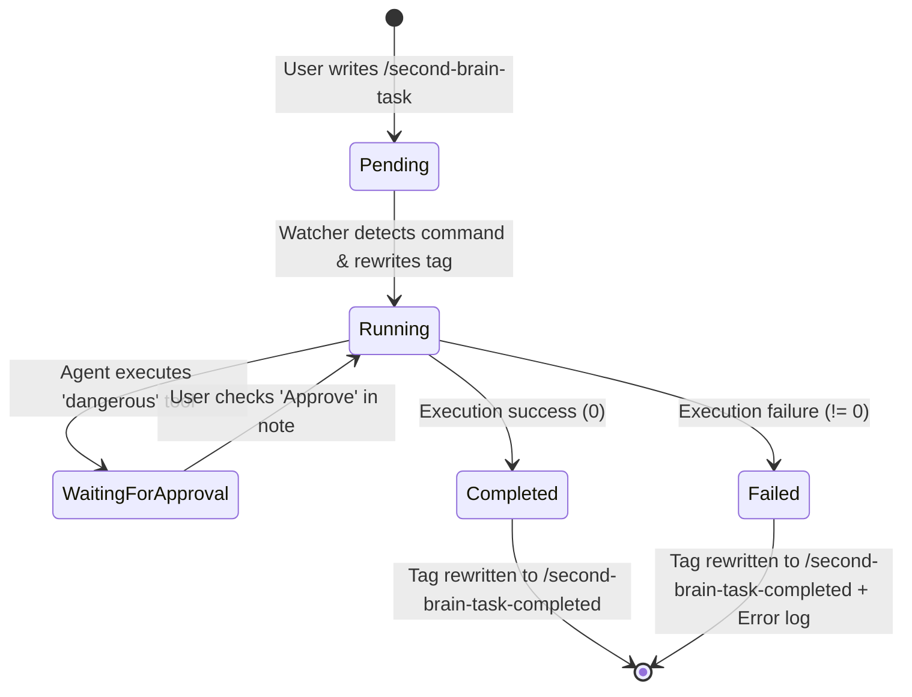
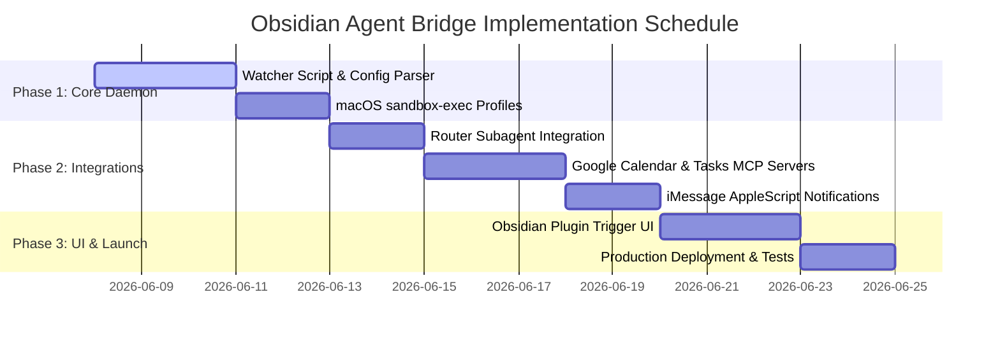

# System Design Document: Obsidian-to-Agent Automation Bridge (OAB)

* **Author:** Hardik Khandelwal
* **Status:** PROPOSAL / REVIEW
* **Date:** 2026-06-07
* **Version:** 1.0.0
* **Target Audience:** Engineering, Security, and Personal Productivity teams

---

## 1. Executive Summary

The **Obsidian-to-Agent Automation Bridge (OAB)** is a secure, headless synchronization and execution daemon that enables remote orchestration of LLM-based coding and productivity agents (specifically Antigravity / `agy`) directly from any Obsidian client (macOS/iOS) using iCloud Drive as a communication bus.

By processing inline markdown commands and enforcing strict macOS kernel-level sandboxing, OAB acts as a secure, zero-friction gateway for executing automated workflows (e.g. calendar booking, task reminders, note organization) remotely.

---

## 2. Problem Statement & Objectives

### 2.1 Problem Statement
Developers and power-users want to trigger AI coding and automation agents while away from their desktops (e.g., on an iPhone). However, remote agent execution introduces critical challenges:
1. **Network Connectivity Constraints:** iOS devices and macOS hosts are rarely on the same local network or accessible via static IP addresses.
2. **Security & Sandbox Escape Risk:** Background agents running with elevated permissions (e.g., `--dangerously-skip-permissions`) could potentially access sensitive directories (SSH keys, documents, configurations) if compromised or hallucinating.
3. **Execution Control & Latency:** Real-time feedback, approvals for dangerous terminal actions, and execution logs must sync back to the mobile device with minimal latency and battery impact.

### 2.2 Objectives (Goals)
* **Zero-Setup Sync:** Leverage native iCloud Drive synchronization to bypass custom network routing.
* **Least-Privilege Security:** Contain the agent completely within the Obsidian vault directory at the OS kernel level.
* **Inline Interface:** Trigger tasks directly within any markdown note using simple inline tag delimiters.
* **Manual Approval Gate:** Interrupt execution and request checkbox confirmation in Markdown for destructive commands.
* **iMessage Notifications:** Notify the user of status changes and approvals via native macOS iMessage.

### 2.3 Non-Goals
* Designing a custom cloud backend (all sync and computation must remain local to iCloud and the macOS host).
* Creating a new LLM model (OAB acts strictly as an orchestration interface for existing models).

---

## 3. High-Level Architecture

The system consists of three main boundaries: the **Obsidian Client (Mobile/Desktop)**, the **iCloud Synchronization Bus**, and the **macOS Execution Host**.



---

## 4. Detailed Design & Component Specifications

### 4.1 Inline Task Parser & State Machine
The Watcher monitors markdown files and uses a stateless regex pattern parser (`re.DOTALL`) to find active block commands:
```regex
/(second-brain-task(?:-running|-completed)?)\n(.*?)\n<end-task>
```

#### Task State Transition Diagram


### 4.2 Security & Kernel Sandboxing
To enforce absolute system security, OAB executes the agent provider using macOS `sandbox-exec` using a dynamically generated Sandbox profile (`.sb`):

```scheme
;; Sandbox Profile for Obsidian Agent Bridge
(version 1)
(deny default)

;; System execution dependencies
(allow process-fork)
(allow sysctl-read)

;; Read-only execution paths
(allow file-read*
       (subpath "/bin")
       (subpath "/usr/bin")
       (subpath "/usr/lib")
       (subpath "/System/Library")
       (subpath "/Users/hardikkhandelwal/.gemini/antigravity-cli"))

;; Read/Write access strictly bound to Obsidian Vault
(allow file-read* file-write*
       (subpath "/Users/hardikkhandelwal/Library/Mobile Documents/iCloud~md~obsidian/Documents/iCloudObsidian"))
```

### 4.3 Routing and Parameter Determination
Before running a task, the OAB watcher executes a **Router Subagent** (powered by `gemini-1.5-flash`) to perform task-complexity classification. 

```
Input Prompt -> [Router Subagent] -> Output JSON Configuration
```

#### Router Prompt Contract
```json
{
  "complexity": "simple | complex",
  "model_recommendation": "gemini-1.5-flash | gemini-1.5-pro",
  "required_mcp_servers": ["google-calendar", "google-tasks", "mac-notifications"]
}
```

---

## 5. Cross-Cutting Concerns

### 5.1 Security & Threat Model

| Threat | Mitigating Design | Impact |
| :--- | :--- | :--- |
| **Directory Traversal / Access to sensitive files** | macOS `sandbox-exec` profile rejects any filesystem reads outside `/iCloudObsidian/`. | **Mitigated** (Kernel level) |
| **Command Injection (Rogue terminal runs)** | System command execution tools (`execute_command`) are classed as "Dangerous" and blocked by the **Markdown Approval Gate**. | **Mitigated** (User approval required) |
| **iCloud Sync Collision** | Daemon calculates file hashes before run. If vault file hash changes during execution, changes are written to a conflict file. | **Mitigated** (No data loss) |

### 5.2 Performance & Resource Management
* **Incremental Directory Walk:** Walking the entire directory is avoided. The watcher caches the epoch timestamp of the last check and only walks files where `os.path.getmtime(filepath) > last_scan_time`.
* **API Cost Control:** Simple queries are routed to the lightweight Flash model. Pro models are reserved strictly for multiline reasoning operations, saving token budget.

### 5.3 Reliability & Resiliency
* **TCC AppleScript Timeout:** Any AppleScript execution is bound by a `10s` subprocess timeout. If it hangs (usually indicating a macOS permission prompt), the watcher logs a descriptive error and terminates gracefully.
* **Network Offline:** If Google API queries fail due to network offline states, tasks are queued and retried with exponential backoff.

---

## 6. Alternatives Considered

### 1. Folder-Based Kanban Pipeline
* *Why it was rejected:* High friction. Moving files between folders on iOS is clumsy compared to writing `/second-brain-task` directly within an active daily note.

### 2. AppleScript Native sync via macOS Accounts
* *Why it was rejected:* Bypassing direct Google APIs in favor of macOS Calendars was considered, but direct Google Calendar/Tasks MCP Servers provide better cross-platform compatibility and do not require your Google Account to be synced locally on the Mac's host OS account.

---

## 7. Rollout Plan & Milestones


